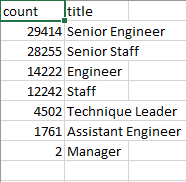
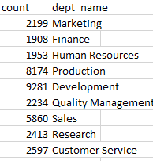
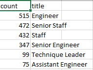
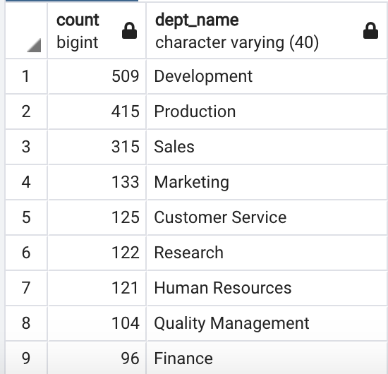

# Pewlett_Hackard_Analysis

## Overview
Pewlett_Hackard is a large, well established company with over 54,000 current employees.  The company is currently offering retirement packages for employees who meet certain criteria.
### Purpose
The purpose of this analysis is to answer two important questions:
 - How many roles will need to be filled as employees begin to retire?
 - Are there enough qualified, retirement-ready employees in the individual departements to menter future employees?
### Resourses
 - Data Source:
   - departments.csv
   - dept_emp.csv
   - titles.csv
 - Software:
   - Python 3.6.1
   - Pandas
   - pgAdmin4
   - postgresSQL
   
## Results of the Analysis
The queries for mentorship by title and department were derived from [mentor elegibility](https://github.com/MiguelDi/Pewlett-Hackard-Analysis/blob/main/Challenge%20Data%20%26%20Queries/mentorship_eligibilty.csv)
 - ### Number of Retiring Employees by Title
 !
 - ### Number of Retiring Employees by Department
 !
 - ### Number of Employees Eligible for the Mentorship Program by Title
 !
 - ### Number of Employees Eligible for the Mentorship Program by Department
 !

## Summary
### How many roles will need to be filled as employee's retirements begin to make and impact?
From the analysis the number of employees about to retire per department are as follows:
   - Marketing: 2,199.
   - Finance: 1,908
   - Human Resources: 1,953
   - Production: 8,174
   - Development: 9,281
   - Quality Management: 2,234
   - Sales: 5,860
   - Research: 2,413
   - Customer Service: 2,597.
   - Total future retirees: 36,619.
 
### Are there enough qualified, retirement ready employees in the departments to menter the next generation?
Under the assumption that qualified employees would be the most efficient mentoring  future replacements in their areas of expertise.  I have broken down the elegible employees for mentoring positions by their current departments.
   - Marketing: 133.
   - Finance: 98
   - Human Resources: 117
   - Production: 418
   - Development: 511
   - Quality Management: 102
   - Sales: 313
   - Research: 124
   - Customer Service: 124.
   - Total future retirees: 1,940
